# Welcome to Condominio Montezuma, Grecia, Alajuela, Costa Rica

Welcome to Condominio Montezuma, a stunning residential development located in the picturesque city of Grecia, in the province of Alajuela, Costa Rica. Known for its pleasant climate, beautiful landscapes, and friendly community, Grecia is the perfect location for those seeking a peaceful lifestyle with easy access to modern amenities.
<!--begin:hero-->
## A Glimpse into Condominio Montezuma

<!--end:hero-->
Condominio Montezuma offers a blend of luxury, comfort, and natural beauty. The condominium features a variety of home styles, each designed to meet the highest standards of quality and aesthetic appeal. Whether you're looking for a cozy home or a more spacious family residence, Condominio Montezuma has something to suit your needs.

**Website**: [condominio-montezuma.casa.club](http://condominio-montezuma.casa.club)

**Definition**: 
> Condominio Montezuma is a premium residential complex located in Grecia, Alajuela, Costa Rica. Renowned for its scenic beauty and peaceful living environment, it offers a blend of modern living and natural charm. The complex features various types of housing options, each designed to meet high standards of quality and aesthetics. Key amenities include a swimming pool, clubhouse, and landscaped green spaces, making it an ideal choice for those seeking a serene yet convenient lifestyle.

**Location**: 
> Situated in the picturesque town of Grecia, in the province of Alajuela, Condominio Montezuma provides easy access to local attractions and essential amenities. Its proximity to major highways facilitates convenient travel to and from the complex.

**Highlights**: 
- Modern and stylish housing designs
- Range of community facilities including a pool and clubhouse
- Ideal climate and friendly community atmosphere

### Key Features

- **Location**: Nestled near the Bernardo Soto Highway, our condominium offers easy access to major transportation routes.
- **Modern Designs**: Each home boasts contemporary architecture, blending seamlessly with the natural surroundings.
- **Community Amenities**: Residents enjoy access to a range of amenities including a swimming pool, clubhouse, and green areas.

<!--begin:hero-->
## Homes in Condominio Montezuma

<!--end:hero-->

<!--begin:gallery-columns-3-->

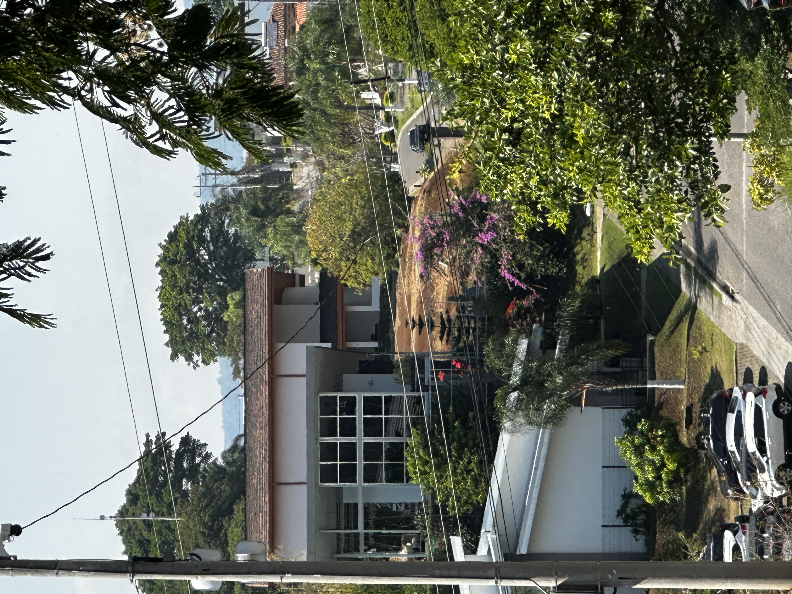
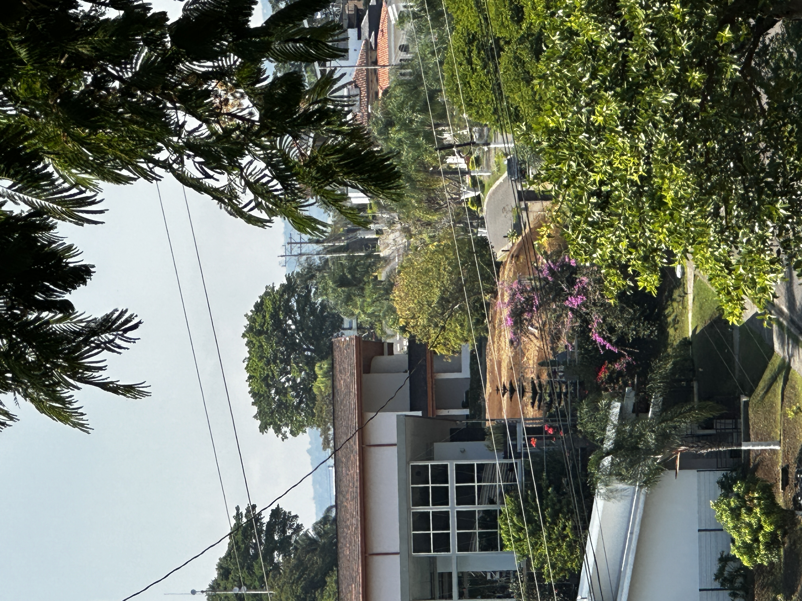

<!--end:gallery-columns-3-->

### Example Listing: Spacious 3-Bedroom Home
- **Price**: ₡ 109,500,000.00
- **Size**: 153 square meters on a 207 square meter lot.
- **Features**: This charming house offers a spacious living area, modern kitchen, and a tranquil backyard.

## Living in Grecia, Alajuela

Grecia is renowned for its unique charm and vibrant culture. Living in Condominio Montezuma gives you the opportunity to experience the best of Costa Rican living:

- **Climate**: Enjoy the perfect climate year-round, with temperatures that are warm but not too hot.
- **Community**: Grecia is known for its friendly locals and expat community.
- **Accessibility**: Proximity to San José, Costa Rica's capital, provides access to top-notch healthcare, shopping, and entertainment.

<!--begin:hero-->
### Sports and Fitness: Energize Your Lifestyle

<!--end:hero-->

Condominio Montezuma is not just a place to live; it's a community that promotes an active and healthy lifestyle. Our comprehensive sports facilities cater to a wide range of interests and fitness levels, ensuring there's something for everyone.

#### State-of-the-Art Gym

<!--begin:gallery-->
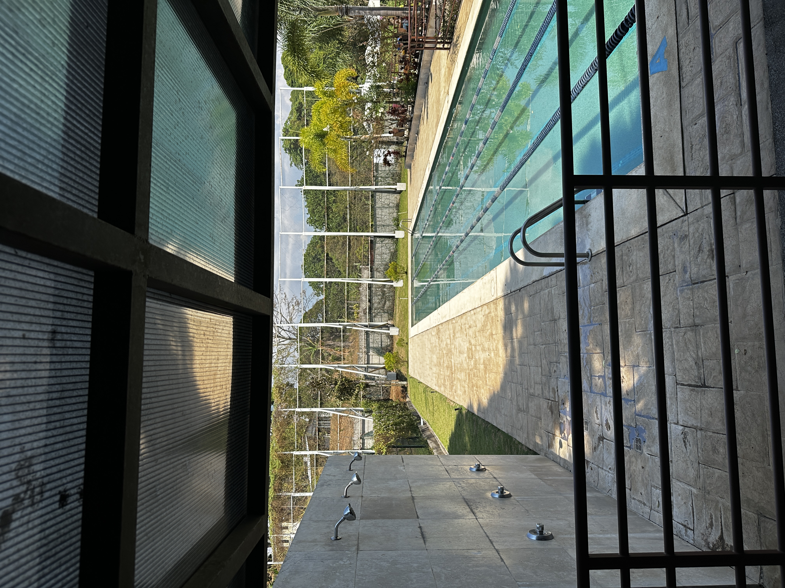

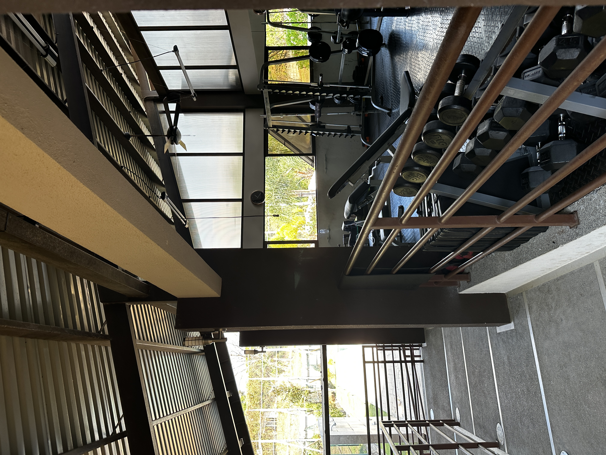
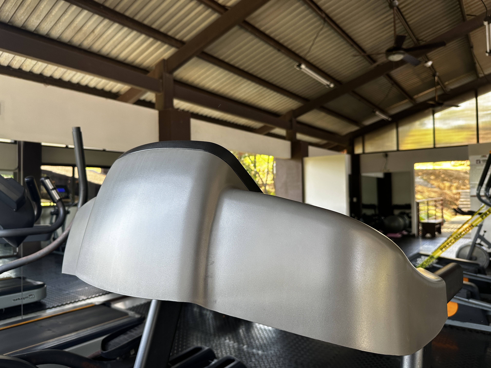
<!--end:gallery-->

 - **Semi-Olympic Pool**: Ideal for both competitive swimmers and casual bathers, our pool provides ample space for lap swimming and water-based workouts. The pool includes marked lanes for serious swimmers to track their laps and for training sessions.
- **Weight Training Area**: Equipped with a variety of free weights and machines, perfect for strength training and muscle building.
- **Cardio Zone**: Featuring treadmills, stationary bicycles, and orbitrek machines, ideal for cardiovascular health.
- **Yoga and Stretching Space**: A tranquil area designated for yoga and stretching exercises, helping you maintain flexibility and balance.

#### Racquet Sports

<!--begin:gallery-->
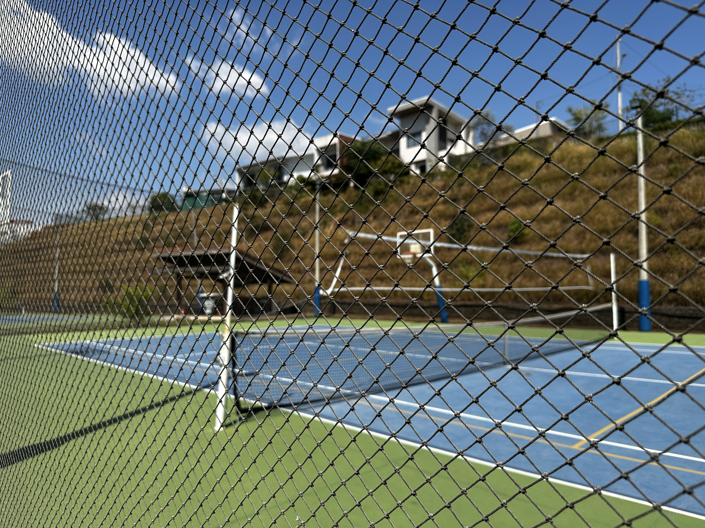

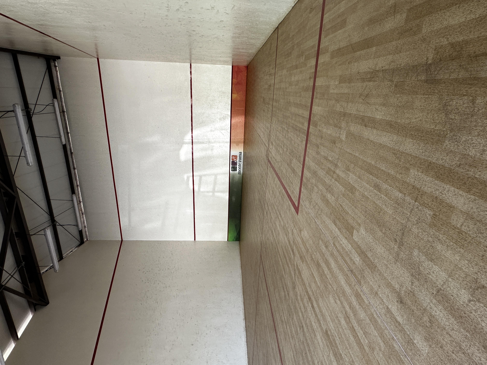
<!--end:gallery-->

- **Squash Courts**: Two high-quality squash courts for an intense, fast-paced workout.
- **Tennis Courts**: Two well-maintained tennis courts, perfect for casual plays or competitive matches.

#### Team Sports Facilities

<!--begin:gallery-->
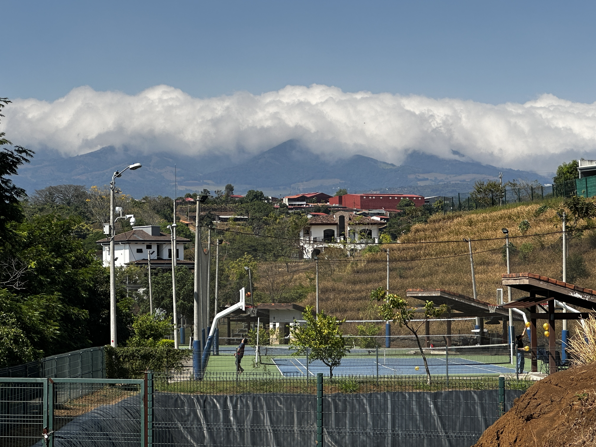

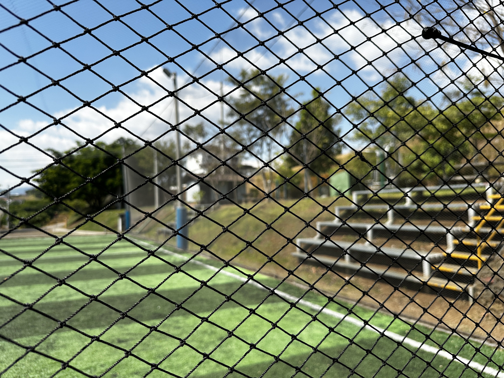
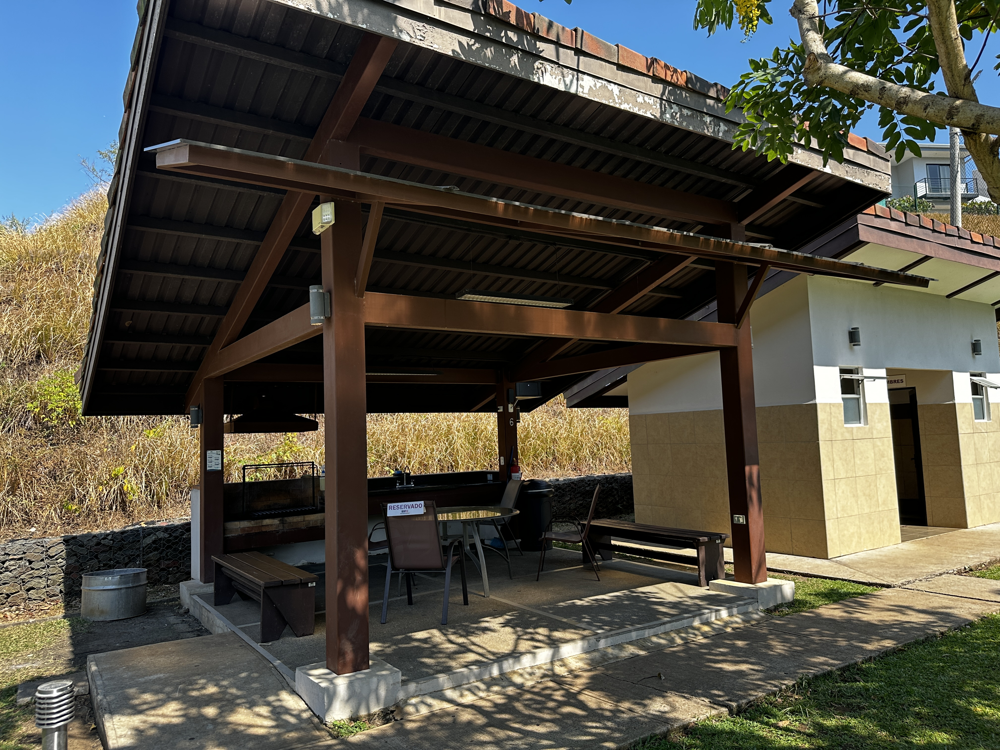
<!--end:gallery-->

- **Basketball Courts**: Two full-sized basketball courts for team games or individual practice.
- **Beach Volleyball Court**: Experience the fun of beach volleyball right in your backyard.
- **Football 5 Field**: A compact football pitch designed for 5-a-side games, offering a fast and exciting version of the sport.

#### Outdoor Fitness

<!--begin:gallery-->

<!--end:gallery-->

- **Open-Air Free-Weight Machines**: Strategically placed in the open air for those who prefer to train amidst nature.
- **Walking Trails**: Surrounding the condominium, these trails are perfect for a peaceful walk, jog, or run, offering scenic views and a chance to connect with nature.

### A Community Focused on Well-being

At Condominio Montezuma, we believe in fostering a community that values health and fitness. Our sports facilities are more than just amenities; they are a foundation for a vibrant, active, and connected community. Whether you're a fitness enthusiast or just enjoy a casual game with friends, our sports complex offers an unmatched experience.

*Note: All facilities are maintained according to the highest standards to ensure safety and quality experiences for all residents.*

## Verdant Splendor: Vegetation Around Condominio Montezuma

Surrounded by the lush greenery of tropical jungles and the thriving fields of coffee and sugar cane, Condominio Montezuma is a haven for nature lovers and those who appreciate the beauty of Costa Rica's diverse flora.

### Tropical Jungle

<!--begin:gallery-zoom-->

<!--end:gallery-zoom-->

The tropical jungle that encircles the area is a vibrant ecosystem teeming with life. This dense vegetation is characterized by:

- **Tall Trees**: Towering over the landscape, these trees form a canopy that shelters an array of wildlife.
- **Understory Layer**: Filled with shrubs, small trees, and plants like ferns and orchids, this layer thrives in the dappled sunlight.
- **Rich Biodiversity**: Home to a plethora of birds, insects, and small mammals, the jungle is a symphony of nature's sounds.
<!--begin:hero-->
### Coffee Plantations

<!--end:hero-->
Coffee, one of Costa Rica's prime exports, grows abundantly in the region. The plantations are a sight to behold with their:

- **Verdant Coffee Bushes**: Neat rows of coffee plants, laden with red and green cherries, are a testament to the region's fertile soil.
- **Harvest Season**: A bustling time of year when the air is filled with the aroma of fresh coffee beans.

### Sugar Cane Fields

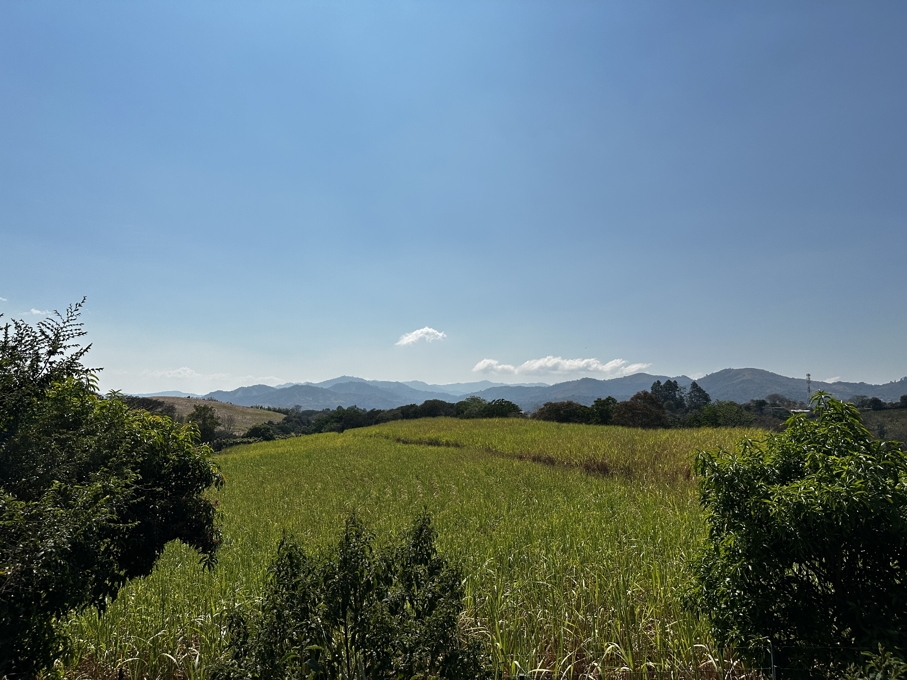

Sugar cane is another vital crop in the area, contributing to both the local economy and the landscape's charm. The fields feature:

- **Tall Stalks of Sugar Cane**: These swaying green stalks paint a picturesque rural scene.
- **Traditional Harvesting Techniques**: Witness the age-old methods of harvesting and processing sugar cane.

### A Green Retreat

Condominio Montezuma, set against this backdrop of natural beauty and agricultural prosperity, offers a unique opportunity to experience life in harmony with nature. Residents and visitors alike can enjoy:

- **Nature Walks & Bird Watching**: Explore the trails and discover the rich birdlife.
- **Agricultural Tours**: Learn about coffee and sugar cane production, right from the source.
- **Tranquil Living**: The perfect blend of rural charm and modern amenities.

<!--begin:gallery-columns-4-->

<!--end:gallery-columns-4-->

This lush, green environment not only provides a serene living space but also contributes to the health and well-being of the community, making Condominio Montezuma a true paradise.

Certainly! Here's a Markdown section dedicated to nature trails around Condominio Montezuma, ideal for walking and exploring the natural surroundings.

### Nature Trails: Walk Amidst Serenity

Condominio Montezuma is not just a residential oasis but also a gateway to the tranquil beauty of Costa Rican nature. The area boasts a network of nature trails, perfect for those who seek to immerse themselves in the serenity of the outdoors.

#### Discover the Trails

- **Jungle Pathways**: Wander through the heart of the tropical jungle, where the lush canopy overhead provides a cool, shaded environment. These trails are an opportunity to experience the vibrant biodiversity of the region up close.
- **Plantation Walks**: Meander through the coffee and sugar cane plantations. These walks offer a unique insight into the agricultural life of Costa Rica and the process of coffee and sugar production.

#### Wildlife and Flora

- **Bird Watching**: The trails are a haven for bird enthusiasts. With Costa Rica's rich avian population, one can spot a variety of tropical birds in their natural habitat.
- **Floral Wonders**: The trails are lined with an array of tropical flowers, including exotic orchids and colorful bromeliads, offering a feast for the eyes and a subject for amateur and professional photographers alike.

#### Health and Wellness

- **Peaceful Retreats**: The trails offer a peaceful retreat from the hustle and bustle of daily life, allowing residents to unwind, meditate, or simply enjoy the tranquility of nature.
- **Active Lifestyle**: Ideal for jogging, walking, or a leisurely stroll, these trails promote an active and healthy lifestyle amidst natural beauty.

#### Community Activities

- **Guided Walks**: For those new to the area or looking to learn more about their natural surroundings, guided walks can be organized, offering educational and interactive experiences.
- **Eco-Friendly Practices**: The maintenance and use of these trails are governed by eco-friendly practices, ensuring minimal impact on the environment and preservation of the natural beauty.

Condominio Montezuma’s nature trails provide a unique blend of leisure, exploration, and education, making them a cherished feature of the community. They offer a perfect way to connect with nature, stay active, and enjoy the peace and beauty of Costa Rican flora and fauna.

*Note: Trail availability and conditions can vary depending on weather and maintenance schedules.*

## Join Our Community

Become a part of Condominio Montezuma and start your new life in this beautiful Costa Rican paradise. Contact us for more information and to schedule a visit.

@[youtube](http://www.youtube.com/embed/JlGaE02D_3U)

<!--begin:bezier-curve-->
---
<!--end:bezier-curve-->

For more information, please visit our [website](https://condominio-montezuma.casa.club) or contact our sales office.
